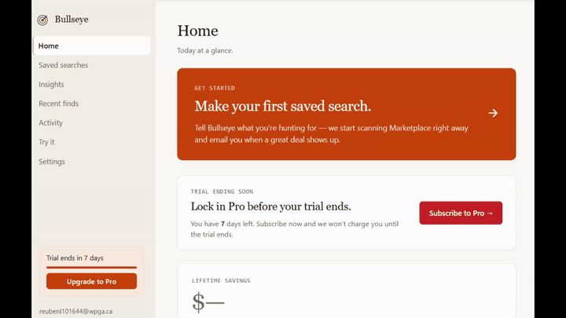

<div align="center">


# Bullseye

**Score Marketplace deals against real eBay sale comps.**

[Download for Windows](https://getbullseye.app/Bullseye-Setup.exe) · [Website](https://getbullseye.app) · [License](#license)

</div>

---

> 🎯 **Latest find**
> Herman Miller Aeron Size B — asking **$385**, eBay sold-comp median **$602**
> **Score: 87** · **$215** below market · caught 14 minutes after the listing appeared
>
> *(Pinned example. Updated occasionally with real finds.)*

---



*Type a listing into `/test` and watch it scored against real eBay sold comps in real time.*

---

## Why Bullseye

- **Free forever** — 3 saved searches, 5-minute Marketplace scanning, real comps, daily email digest. No trial clock, no card.
- **Deterministic scoring** — same listing, same comps, same score, every time. The math is plain Python in [`appraisal/formula.py`](desktop/src/deal_finder/appraisal/formula.py); no LLM in the scoring path.
- **Real eBay sold comps** — Tukey-trimmed median + IQR from the eBay Browse API, last 90 days. Not "estimated value", not Marketplace-comparing-to-Marketplace.
- **No Facebook login** — Bullseye reads public Marketplace listings the same way an unauthenticated browser does. Your account is never touched, never bannable.
- **Open source (AGPL-3.0)** — every line is on GitHub. Read it, run it, fork it. The catch: if you host a derivative service for others, your modifications have to be open-source too.

---

## How scoring works

1. A new listing appears on Facebook Marketplace.
2. Title is normalized via a small LLM (MiniMax) → clean eBay search term. *This is the only LLM in the path; result is cached 12 hours.*
3. The cloud comp pipeline (Supabase Edge Function) fetches eBay sold comps from the Browse API for the last 90 days.
4. Outliers are trimmed using Tukey fences (1.5 × IQR), and a trimmed median + IQR are computed.
5. The asking price's **percentile rank** within the comp distribution drives the raw score:

   ```
   score = (1 − percentile_rank) × 100
   ```

   *Score 80 = cheaper than 80% of comparable sold listings. Score 50 = roughly at the median. Score 20 = priced 20% above the median.*
6. The raw score is then capped by:
   - A **confidence band** (wider when the sample size is small or comps are dispersed).
   - **Honesty guards** that prevent inflated scores: heterogeneous comp sets cap at 70 (e.g. "VEVOR Linear Actuator" matches every length+load class on eBay), sub-$30 listings cap at 80 (low signal-to-noise), low absolute savings (< $25) cap at 75 (a 20% discount on a $10 item isn't a "great deal").
7. A condition adjustment shifts the score (e.g. `−15` for "needs repair", `+5` for "excellent condition").
8. **Score ≥ 80** → worth a manual look. **Score ≥ 90** → act fast.

Full math, the trade-offs, and the version history are in the docstring at the top of [`formula.py`](desktop/src/deal_finder/appraisal/formula.py). Tests live in [`test_formula.py`](desktop/tests/test_formula.py).

---

## Installation

[**Download `Bullseye-Setup.exe`**](https://getbullseye.app/Bullseye-Setup.exe) — ~32 MB, Windows 10/11.

> ⚠️ **SmartScreen warning?** Click **More info → Run anyway**.
> The installer isn't code-signed yet (certs are $200/yr; rolling that in once we hit revenue). The warning is reputation-based — every brand-new Windows app gets it until enough downloads have accumulated.

**Want to verify the binary?** Compare the SHA-256 hash:

```powershell
# Windows
Get-FileHash Bullseye-Setup.exe -Algorithm SHA256

# macOS / Linux
shasum -a 256 Bullseye-Setup.exe
```

The current release hash is on the [GitHub releases page](https://github.com/reubenlavin08/bullseye-app/releases) — match it before running.

macOS is on the roadmap. [Join the waitlist](https://getbullseye.app/download.html) to get notified when the .dmg ships.

---

## Free vs Pro

|  | Free | Pro |
|---|---|---|
| Active saved searches | 3 | Unlimited |
| Marketplace scanning interval | 5 min | 5 min |
| Email alerts | Daily 8am digest | Instant (60s batched) |
| Desktop notifications | Yes | Yes |
| Score breakdown | Score + savings | Full (percentile rank, sample size, confidence band, outliers, condition flags) |
| Live observability dashboard | No | Yes |
| Price | **Free forever** | **$9.99 / mo** or **$99 / yr** · 7-day trial, no card |

The free tier is genuinely free, not a crippled trial. Pro is for resellers and power users who want unlimited watches plus instant alerts.

---

## Tech stack

| Layer | What |
|---|---|
| Desktop app | Python 3.12 · Flask · pywebview (WebView2) · SQLite |
| Installer | PyInstaller + Inno Setup |
| Cloud | Supabase Postgres (auth + storage) · Supabase Edge Functions (Deno / TypeScript) |
| Comp data | eBay Browse API |
| Title normalization | MiniMax LLM (cached 12 h) |
| Email | Resend |
| Payments | Stripe Checkout + Customer Portal |
| Landing | Cloudflare Pages |

The polling scraper runs on **your** machine, not on a central server. Each install hits Facebook from the user's home IP at the cadence of a normal browser session — there is no central scraper IP for Facebook to block, and no Facebook account ever gets touched.

---

## Repository layout

- **`desktop/`** — Python desktop app (UI, scheduler, local scraper, SQLite, installer build).
- **`cloud/`** — Supabase migrations + Edge Functions (comp pipeline, license, billing, email, telemetry, achievements).
- **`landing/`** — Static landing page (`getbullseye.app`).
- **`LICENSE`** — AGPL-3.0.

---

## Known limitations

- **Windows only** for v0.1. macOS is next; Linux is on the maybe pile.
- **Unsigned installer** triggers Windows SmartScreen on first run — see the install notes above.
- **Cars and heavy vehicles**: eBay sold-listing volume for used vehicles is thin, so comp-based scoring is less reliable there. The app applies a wider minimum confidence band on the vehicles category, but treat car scores as a starting point, not a verdict.
- **Facebook redesigns can break the parser**. Has happened twice during alpha; both times patched within ~24 h. Open-source means anyone can submit the fix.
- **No proxies, no headless Chrome**. Bullseye polls public listing endpoints from your home IP. If Facebook ever rate-limits a residential IP that runs Bullseye, that user is paused, not the entire userbase.

---

## Building from source

```powershell
# Windows, from the repo root
cd desktop
python -m venv .venv
.\.venv\Scripts\Activate.ps1
pip install -r requirements.txt

# Run the app from source
python -m src.main

# Build a fresh installer (requires Inno Setup 6 installed)
cd build
.\build_windows.bat
```

You'll need a `.env` with the cloud-side keys (Supabase, Stripe, Resend, eBay, MiniMax) for full functionality. See [`.env.example`](.env.example).

Tests:
```powershell
cd desktop
python -m pytest
```

---

## License

[AGPL-3.0](LICENSE) — read it, run it, fork it for personal use. If you host a derivative service for others, your modifications also have to be open-source under AGPL. Same license as Plausible, Cal.com, Sentry, and Grafana, for the same reason: keeps the ecosystem honest.

---

## Contributing

Bullseye is solo-built right now, but PRs are welcome. Open an issue first for anything bigger than a typo so we can talk through the approach before you write code.

By submitting a PR, you agree to license your contribution under AGPL-3.0.

---

<div align="center">

Built in Vancouver, BC · Questions: [hello@getbullseye.app](mailto:hello@getbullseye.app)

</div>
